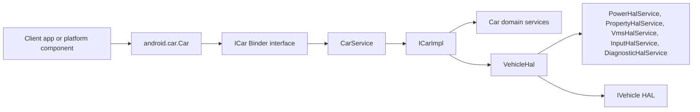

# Android Automotive Car Services Architecture Analysis

## Introduction

This document explains the current architecture of the Android Automotive car services repository under `packages/services/Car`, based on the source files that define the client API, the `CarService` runtime, the central service coordinator, the vehicle HAL bridge, property and VMS event pipelines, and the user-scoped service helpers. The goal of this page is to describe how the repository is structured at runtime, which components own which concerns, where orchestration is concentrated, how callback-based interactions are used, and how startup, reconnection, shutdown, and user-switch lifecycles are coordinated.

The analysis focuses on the implementation that exists today in the repository. It does not describe hypothetical future modules, and it does not attempt to cover every support library, sample application, or test component in equal depth. Instead, it concentrates on the runtime path that starts with clients using `android.car.Car`, flows through Binder into `CarService` and `ICarImpl`, and fans out into domain services and HAL-facing adapters.

## Objectives

The objective of this analysis is to make the repository’s architectural intent legible to engineers who need to understand the system beyond a package listing. In particular, it explains which modules act primarily as API surfaces, which modules act as runtime orchestrators, which modules own hardware integration, which services are responsible for policy or per-user behavior, and which interactions rely on callback and observer patterns instead of synchronous request-response calls.

A second objective is to show how lifecycle coordination works in practice. The Automotive car stack is not just a static set of services. It has to survive HAL restarts, user changes, delayed service binding, boot-time user selection, and listener death. Those behaviors are distributed across a few critical files, and understanding those files is necessary to understand the real system behavior.

## Scope

This document covers the currently implemented architecture of the core Android Automotive car service stack inside this repository. The discussion is centered on the public client entry point in `car-lib`, the main `CarService` Android service, the `ICarImpl` coordinator, the `VehicleHal` abstraction, the HAL service base classes, the property service pipeline, the VMS glue layer, and the user-scoped helper and user boot service.

This document does not attempt to provide a full catalog of every repository module such as EVS samples, product overlays, test apps, native utilities, or support-library wrappers, except where they help clarify boundaries or layering. It also does not serve as a low-level API reference for individual manager classes.

## High-Level Architecture

At a high level, the repository follows a layered Automotive platform architecture with three dominant runtime tiers. The top tier is the client API layer in `car-lib`, where applications and platform components use `android.car.Car` to bind to the car system service and obtain manager-specific Binder interfaces. The middle tier is the Binder service tier inside the `service` module, where `CarService` hosts `ICarImpl` and `ICarImpl` instantiates and coordinates a graph of domain services such as power, property, package policy, driving state, UX restrictions, projection, cluster, Bluetooth, storage monitoring, VMS, and user services. The bottom tier is the hardware integration tier, where `VehicleHal` connects to `IVehicle`, discovers supported properties, assigns each property to a specific HAL subservice, manages subscriptions, and dispatches HAL callbacks to the right handler.

The most important architectural observation is that `ICarImpl` is the principal orchestration hub for the Binder-facing service graph, while `VehicleHal` is the principal orchestration hub for hardware-facing property routing. The repository is therefore split between a service orchestration plane and a HAL orchestration plane. The former owns service construction order, permission gating, and service exposure. The latter owns property ownership, subscription control, and event dispatch.

### Runtime topology

The following diagram shows the runtime relationship among the main client, service, and HAL components.

This diagram should be read from left to right. Client code creates or receives an `android.car.Car` instance, binds to the `android.car.ICar` interface, and reaches `CarService`. `CarService` itself is intentionally thin. It constructs `ICarImpl`, registers it with the Android service manager, and delegates most ongoing coordination to `ICarImpl`. `ICarImpl` in turn owns both the Binder-facing service graph and the `VehicleHal` bridge that manages HAL-facing services.

### Major architectural components

The repository’s major architectural components can be understood as six cooperating groups.

First, the client access layer is represented by `car-lib/src/android/car/Car.java`. This class defines the well-known service names, owns client connection state, retries binding if `CarService` is temporarily unavailable, and creates type-specific manager wrappers once the Binder service is available. It is the stable application-facing entry point.

Second, the Android service entry layer is represented by `service/src/com/android/car/CarService.java`. This class is the Android `Service` declared in the service manifest. It obtains the `IVehicle` service, constructs `ICarImpl`, initializes it, links a HAL death recipient, and registers the Binder service as `car_service`. It is intentionally small because it exists mainly to integrate with Android service lifecycle and service manager registration.

Third, the service orchestration layer is represented by `service/src/com/android/car/ICarImpl.java`. This file is the dominant runtime composition root. It constructs nearly all major car domain services, orders them for initialization and teardown, routes public service names to Binder instances through `getCarService(String)`, exposes a limited internal service lookup for selected internal consumers, and applies permission checks before returning sensitive services.

Fourth, the HAL abstraction layer is represented by `service/src/com/android/car/hal/VehicleHal.java`. This class wraps the `IVehicle` HIDL interface, fetches all supported property configurations, assigns each property to exactly one `HalServiceBase` implementation, manages active subscriptions, handles HAL reconnection, and dispatches property events and set errors to the owning HAL subservice.

Fifth, the HAL domain adapter layer is represented by specialized classes such as `PowerHalService`, `PropertyHalService`, and `VmsHalService`. These modules translate raw HAL property traffic into domain-specific semantics. Each one claims ownership of the properties it understands through `takeSupportedProperties(...)`, initializes only if those properties exist, and converts HAL event streams into higher-level callbacks used by Binder-facing services.

Sixth, the user-scoped coordination layer is represented by `PerUserCarServiceHelper` and `CarUserService`. These modules exist because some Automotive behavior is inherently user dependent. One helper binds to a per-user service and tracks user switches. The other performs boot-time user provisioning and switching for headless-system-user systems.

### Core services

The repository contains many car services, but a smaller subset acts as the architectural backbone.

`CarService` is the runtime process entry point for the core car service package. Its most important responsibilities are obtaining the vehicle HAL, creating the service coordinator, publishing the Binder service, monitoring HAL death, and triggering HAL reconnection logic. It is not the place where most domain logic lives.

`ICarImpl` is the central car service implementation. The constructor shows that it creates the service graph directly, including `CarPowerManagementService`, `CarPropertyService`, `CarDrivingStateService`, `CarUxRestrictionsManagerService`, `CarPackageManagerService`, `CarInputService`, `CarProjectionService`, `GarageModeService`, `CarLocationService`, `AppFocusService`, `CarAudioService`, `CarNightService`, `InstrumentClusterService`, `SystemStateControllerService`, `PerUserCarServiceHelper`, `CarBluetoothService`, `VmsSubscriberService`, `VmsPublisherService`, `CarDiagnosticService`, `CarStorageMonitoringService`, `CarConfigurationService`, and conditionally `CarUserService`. The constructor order makes the dependency relationships visible. For example, UX restrictions depend on driving state and property service, package policy depends on UX restrictions and activity monitoring, projection depends on input, cluster depends on app focus and input, and Bluetooth depends on property service, the per-user helper, and UX restrictions.

`VehicleHal` is the core hardware bridge. It owns `PowerHalService`, `PropertyHalService`, `InputHalService`, `VmsHalService`, and `DiagnosticHalService`. It is responsible for discovering property support at runtime rather than hardwiring assumptions. The `init()` method fetches all property configs from the live vehicle HAL, lets each subservice claim supported properties, records a property-to-owner map, and initializes each HAL service.

`CarPropertyService` is one of the clearest examples of the bridge between Binder-facing API services and HAL-facing adapters. It extends `ICarProperty.Stub`, implements `CarServiceBase`, and also implements `PropertyHalService.PropertyHalListener`. That combination makes it both a Binder service for clients and a listener for HAL property changes. It owns client listener registration, permission checks, binder death cleanup, dynamic subscription rate selection, and dispatch of `CarPropertyEvent` objects to registered listeners.

`PropertyHalService` is the underlying property adapter that sits beneath `CarPropertyService`. It owns the supported property catalog, translates between `VehiclePropValue` and `CarPropertyValue`, validates subscription rates against property configs, and forwards property change and set-error callbacks to the `CarPropertyService` listener.

`VmsHalService` is a more orchestration-heavy specialized bridge. It sits between the Vehicle HAL and VMS services, managing both publishers and subscribers, routing layer subscriptions, updating availability, and handling a message protocol encoded inside a single HAL property. It is an example of a component whose complexity comes less from startup wiring and more from stateful callback and routing behavior.

`PerUserCarServiceHelper` and `CarUserService` are core to lifecycle correctness rather than feature breadth. They show how user changes are treated as first-class architecture events, not incidental Android details.

### Orchestration-heavy modules

Several files stand out because they coordinate many other pieces instead of primarily implementing a single isolated feature.

`ICarImpl` is the most orchestration-heavy module in the repository portion examined here. It is the composition root, the init-order authority, the shutdown-order authority, the HAL reconnection broadcaster, and the Binder service router. It also centralizes service exposure policy by deciding which service names are valid and what permission gate applies before a caller may obtain a Binder. This means `ICarImpl` owns both structural orchestration and access orchestration.

`VehicleHal` is the second major orchestrator. It handles a different axis of coordination from `ICarImpl`. Rather than coordinating Binder-visible services, it coordinates HAL property ownership and dispatch. It decides which HAL subservice owns each property, enforces that only the owning service can subscribe or unsubscribe that property, stores current subscriptions so they can be re-applied after HAL reconnection, and batches callback dispatch by service using the dispatch lists in `HalServiceBase`.

`VmsHalService` is another orchestration-heavy module, although at a narrower domain scope. It owns layer subscriptions, publisher offerings, publisher information, availability state, HAL subscription mirroring, and notifications to app publishers and subscribers. Unlike simpler adapters, it maintains routing state and transforms between multiple parties rather than just forwarding events.

`PerUserCarServiceHelper` is orchestration-heavy in a lifecycle sense. It coordinates broadcast reception, service unbinding and rebinding across user switches, and client callback notification before and after service connection transitions. This helper makes explicit that user switching is a controlled multi-step process rather than a single Android callback.

`Car.java` on the client side is also orchestration-heavy compared with a thin client stub. It handles connection state, delayed retries, manager instantiation, teardown of all cached managers during disconnect, and uniform access to the Binder-backed service graph.

### Service ownership boundaries

The code exposes several clear ownership boundaries that help keep responsibilities separated.

The first boundary is between client-side manager access and server-side service ownership. `android.car.Car` owns connection management and local manager caching, but it does not own service implementation or policy decisions. The authoritative implementations live behind Binder in `CarService` and `ICarImpl`.

The second boundary is between Android service hosting and domain orchestration. `CarService` owns Android service lifecycle integration and HAL death observation, while `ICarImpl` owns domain service construction, service publication decisions, and coordinated lifecycle execution. This separation keeps the Android framework entry point simpler and pushes most Automotive logic into a composable service coordinator.

The third boundary is between Binder-facing domain services and HAL-facing adapters. `CarPropertyService` is a good example. It owns Binder listener state, permission enforcement, and client event delivery, while `PropertyHalService` owns translation to and from the HAL and property configuration handling. This keeps the public service API concerns separate from hardware protocol concerns.

The fourth boundary is inside `VehicleHal`, where each property is assigned to a single owning `HalServiceBase` implementation. The method `assertServiceOwnerLocked(...)` enforces that only the designated HAL service may subscribe or unsubscribe a property. That is a strong architectural rule because it prevents multiple HAL adapters from competing for control over the same property and makes the property-to-service mapping explicit.

The fifth boundary is between global car services and per-user services. `ICarImpl` owns global coordinator behavior and creates `PerUserCarServiceHelper`, but user-specific binding transitions are delegated to that helper. Likewise, `CarUserService` is only added to the service graph when `CarUserManagerHelper.isHeadlessSystemUser()` returns true, making user boot logic conditional on the deployment model rather than universally mixed into the main service path.

The sixth boundary is the permission boundary around Binder service retrieval. `ICarImpl.getCarService(String)` is not just a lookup table. It applies permissions such as `Car.PERMISSION_CAR_POWER`, `Car.PERMISSION_CAR_NAVIGATION_MANAGER`, `Car.PERMISSION_CAR_INSTRUMENT_CLUSTER_CONTROL`, `Car.PERMISSION_CAR_PROJECTION`, and the VMS publisher or subscriber permissions before returning sensitive services. Architecturally, that means service ownership is paired with centralized exposure control.

### Callback-driven interactions

A major part of the repository’s design is callback driven rather than purely synchronous. Several different callback patterns are used, each for a different type of boundary.

The first and most foundational callback path is the HAL callback path. `VehicleHal` extends `IVehicleCallback.Stub`, so HAL property events arrive asynchronously through `onPropertyEvent(...)` and property-set failures arrive through `onPropertySetError(...)`. `VehicleHal` does not process every event itself. Instead, it looks up the owning `HalServiceBase`, appends the raw values to that service’s dispatch list, and then asks that service to handle its batch. This creates a dispatch callback chain from HAL to `VehicleHal` to the owning HAL subservice.

The second callback path is the property-service listener chain. `PropertyHalService` exposes the `PropertyHalListener` interface with `onPropertyChange(...)` and `onPropertySetError(...)`. `CarPropertyService` implements that listener. When HAL property changes arrive, `PropertyHalService` translates them into `CarPropertyEvent` objects and calls the listener. `CarPropertyService` then fans those events out to registered `ICarPropertyEventListener` Binder callbacks from clients. This is therefore a two-stage callback bridge from HAL events to internal listener to client Binder listeners.

The third callback path is binder death handling in `CarPropertyService`. Each registered listener is wrapped in a `Client` object that links the client binder to a death recipient. If the client process dies, `binderDied()` runs, removes the listener’s property registrations, updates subscription rates, unsubscribes from HAL properties if no listeners remain, and releases the client wrapper. This is a resource ownership callback pattern used to keep subscription state correct in the presence of client failure.

The fourth callback path is power event delivery. `PowerHalService` defines `PowerEventListener` with methods for power state changes, display brightness changes, and boot reason delivery. Incoming power-related HAL events are either queued until a listener is present or dispatched immediately once a listener has been set. This queue-then-dispatch behavior is important because it prevents early HAL signals from being lost during startup ordering.

The fifth callback path is the VMS publisher and subscriber notification model. `VmsHalService` maintains publisher listeners and subscriber listeners. It notifies publishers when the subscription state changes and notifies subscribers when data messages or availability changes arrive. This module uses callbacks as its primary behavioral interface because VMS is fundamentally subscription and routing oriented.

The sixth callback path is service connection and user-switch handling in `PerUserCarServiceHelper`. The helper defines `ServiceCallback` with `onServiceConnected(...)`, `onPreUnbind()`, and `onServiceDisconnected()`. On a user switch broadcast, it first notifies callbacks with `onPreUnbind()`, then unbinds the previous user’s service, and then binds to the new user’s service. On connection changes it relays `onServiceConnected(...)` or `onServiceDisconnected()`. That pattern is explicitly designed for state cleanup and reattachment around user lifecycle transitions.

The seventh callback path is the client’s Android `ServiceConnection` in `android.car.Car`. The `Car` class transitions between disconnected, connecting, and connected states based on service connection callbacks, retries binding when necessary, and tears down all cached manager instances when disconnection occurs. This is the client-side mirror of the service-side lifecycle model.

### Lifecycle coordination patterns

The repository uses a small number of repeatable lifecycle coordination patterns across the main architecture.

The first pattern is composition-root initialization with explicit ordering. `ICarImpl` constructs the service graph in its constructor and stores the services in `mAllServices` in an order that reflects dependencies. The comment in the file makes the intent explicit: services that depend on other services should be initialized later. The `init()` method first initializes `VehicleHal`, then iterates over `mAllServices` in order and calls `init()` on each service. This pattern provides deterministic startup across a graph of loosely coupled services without requiring a separate dependency injection framework.

The second pattern is reverse-order teardown. `ICarImpl.release()` iterates over `mAllServices` in reverse order before releasing the HAL. `VehicleHal.release()` similarly releases its HAL subservices in reverse order, unsubscribes all active properties, and clears runtime maps. This reverse release pattern matches the dependency-aware initialization pattern and reduces the chance of dependent services observing already-destroyed prerequisites.

The third pattern is reconnect-and-broadcast lifecycle repair after HAL death. `CarService` registers a `VehicleDeathRecipient` with the live `IVehicle` binder. When the HAL dies, `serviceDied(...)` unlinks the dead binder, records the crash with `CrashTracker`, attempts to reconnect within a timeout, re-links the death recipient, and then calls `mICarImpl.vehicleHalReconnected(mVehicle)`. `ICarImpl.vehicleHalReconnected(...)` updates the `VehicleHal` instance and then calls `vehicleHalReconnected()` on every registered car service. Architecturally, this creates a clean propagation point for recovery after the hardware boundary restarts.

The fourth pattern is stateful resubscription on HAL reconnection. `VehicleHal` stores active `SubscribeOptions` in `mSubscribedProperties`. When `vehicleHalReconnected(...)` is called, it constructs a new `HalClient` and re-subscribes using the stored options. This means the architecture treats subscriptions as recoverable runtime state rather than one-shot setup.

The fifth pattern is lazy listener activation. `CarPropertyService` only installs itself as the `PropertyHalService` listener when at least one client listener exists. When the last property listener is removed, it clears the HAL listener. This reduces unnecessary dispatching when no Binder clients are subscribed. A similar pattern appears in `PowerHalService`, which queues incoming events until a listener is set.

The sixth pattern is boot-time role-specific behavior. `CarUserService` registers for `ACTION_LOCKED_BOOT_COMPLETED`. On receipt, it either creates a secondary admin user and switches to it on first boot, or switches to the configured default user otherwise. This shows that not all lifecycle coordination is tied to process startup; some behaviors are deliberately delayed until a particular system boot milestone.

The seventh pattern is user-switch rebinding. `PerUserCarServiceHelper` treats a user switch as a structured transition with pre-unbind callbacks, explicit unbinding, and rebinding as the new user. This pattern recognizes that user identity is an architectural axis that changes the correct service instance for certain features.

The eighth pattern is retry-based client binding. `android.car.Car.startCarService()` attempts to bind to the `android.car.ICar` service using `bindServiceAsUser(...)`. If binding fails, it retries up to a maximum count using delayed handler callbacks. If retries are exhausted, it posts a failure runnable that triggers the client-facing disconnection flow. This pattern allows clients to tolerate transient unavailability of `CarService` during boot or service restarts.

### Binder and service exposure model

The Binder exposure model is intentionally centralized. Clients do not bind separately to each car feature service. Instead, they bind once to the `ICar` service and ask for a specific service binder using a symbolic service name such as `audio`, `package`, `power`, `property`, `cluster_service`, `projection`, or `vehicle_map_subscriber_service`. This creates a stable top-level entry point while allowing the internal service graph to remain modular.

On the client side, `android.car.Car.getCarManager(String)` asks the remote `ICar` service for a Binder and then creates a manager object such as `CarAudioManager`, `CarPackageManager`, `CarPowerManager`, `CarPropertyManager`, `CarInstrumentClusterManager`, `VmsSubscriberManager`, `CarDrivingStateManager`, or `CarUxRestrictionsManager`. On the server side, `ICarImpl.getCarService(String)` returns the corresponding Binder service, or returns `null` for unsupported names, while performing permission checks for protected services.

This model creates a clear ownership split. The public contract of available service names and manager wrappers lives in `car-lib`, while the actual implementation ownership lives in `ICarImpl` and the service instances it constructs.

### Property ownership and dispatch model

The property architecture is based on explicit ownership of each HAL property by exactly one HAL subservice. During `VehicleHal.init()`, each `HalServiceBase` implementation is given the opportunity to claim supported properties from the full set returned by `getAllPropConfigs()`. Claimed properties are removed from the remaining pool and recorded in `mPropertyHandlers`. Later, when a property event arrives, `VehicleHal` uses that map to find the correct service and dispatch the event only there.

This design is important because it prevents property handling logic from being smeared across unrelated services. `PowerHalService` only handles properties such as `AP_POWER_STATE_REQ`, `AP_POWER_STATE_REPORT`, `AP_POWER_BOOTUP_REASON`, and `DISPLAY_BRIGHTNESS`. `PropertyHalService` handles the larger surface of generic car properties that are exposed through `ICarProperty`. `VmsHalService` handles `VEHICLE_MAP_SERVICE` and interprets it as a structured VMS protocol rather than a generic value stream.

The model also makes the difference between synchronous and asynchronous property access clear. Synchronous reads and writes go through `VehicleHal.get(...)` and `VehicleHal.set(...)`, often wrapped by the domain-specific HAL service. Asynchronous updates go through subscription and callback pipelines. `CarPropertyService` adds another layer on top by multiplexing multiple Binder clients onto a single HAL property subscription with rate reconciliation.

### Power and system-state coordination

Although this document does not fully detail every power-management file, the visible code already shows the pattern. `CarPowerManagementService` is constructed with the `PowerHalService` and the system interface. `PowerHalService` owns the translation between HAL properties and power-related events such as boot completion, deep sleep entry and exit, shutdown preparation, shutdown postponement, and display brightness changes. It exposes a listener interface so a higher-level power-management service can react to hardware-originated power state changes and emit hardware-facing acknowledgements.

Architecturally, this illustrates an important pattern in the repository. HAL service classes are intentionally not the top-level policy owners. They encode transport and translation logic. Policy-oriented services such as power management or UX restrictions sit above them and combine hardware signals with Android system behavior.

### User-scoped coordination and ownership boundaries

The repository distinguishes between globally hosted car services and functionality that must track the current Android user. `PerUserCarServiceHelper` binds to `PerUserCarService` as `UserHandle.CURRENT` and rebinds across user switches. It offers callbacks so other global services can clean up user-specific state before unbinding and reconnect after the new user service becomes available.

`CarUserService` is a different but related mechanism. It is not about rebinding to per-user helpers. Instead, it owns boot-time user management policy for headless-system-user configurations. Because `ICarImpl` only adds `CarUserService` when `isHeadlessSystemUser()` is true, the architecture explicitly treats user boot logic as a conditional subsystem rather than always-on behavior.

Taken together, these files show that the architecture recognizes user identity as a boundary that affects both service ownership and lifecycle. Some services remain process-global, some services bridge to user-local binders, and some services only exist in certain system-user topologies.

### Failure handling and recovery patterns

The code contains several deliberate failure handling strategies.

At the HAL boundary, `CarService` treats repeated HAL death as a serious system condition. The `CrashTracker` records crash timestamps in a sliding window and triggers a callback if the crash count exceeds a threshold. In user builds this results in user-visible CAN bus failure reporting through `CanBusErrorNotifier`. In non-user builds it escalates by throwing a runtime exception. This is an example of architecture that distinguishes between production-facing recovery and engineering-facing fail-fast behavior.

At the client boundary, `android.car.Car` handles failure to bind by retrying with a bounded retry count. It handles remote exceptions by logging and disconnecting, which also tears down all cached manager objects.

At the listener boundary, `CarPropertyService` handles Binder listener death by unregistering the dead listener’s properties, updating rates, and unsubscribing from HAL properties when no clients remain. This avoids retaining stale subscriptions after client failure.

At the HAL reconnection boundary, `VehicleHal` rebuilds the `HalClient` and reapplies subscriptions, while `ICarImpl` broadcasts reconnection to all services through `vehicleHalReconnected()`. This gives dependent services a consistent recovery hook.

### Architectural implications

Several architectural implications follow from the current design.

The system is intentionally centralized at two levels. Service orchestration is centralized in `ICarImpl`, and hardware property orchestration is centralized in `VehicleHal`. This makes the startup and dispatch behavior understandable from a small number of files, but it also means that these files carry a high change impact. Modifying either one affects a large portion of the runtime graph.

The service graph is dependency ordered but still relatively modular. Individual services implement the `CarServiceBase` lifecycle contract, which allows them to participate in coordinated startup, teardown, dump output, and HAL reconnection without each one having to know the entire system graph.

The callback model is not incidental. It is a core part of the architecture because so many interactions are event driven: property updates, power state transitions, VMS routing changes, Binder death, service connection changes, boot broadcasts, and user switches. Understanding this repository requires following those callback paths, not just the synchronous method calls.

Permission checks are part of the architecture, not just a security afterthought. `ICarImpl` uses the service router itself as a permission enforcement point, which means exposure decisions are co-located with service publication decisions.

User lifecycle is a first-class architectural dimension. The code does not assume that a single process-global service instance is sufficient for all user-related behavior. Instead it explicitly models current-user binding and boot-time user provisioning.

## Conclusion

The Android Automotive car services repository is organized around a clear but layered runtime architecture. `android.car.Car` is the client-side entry point and connection manager. `CarService` is the Android-hosted service entry point. `ICarImpl` is the main Binder-facing composition root and service orchestrator. `VehicleHal` is the main HAL-facing property orchestrator. Specialized HAL services such as `PowerHalService`, `PropertyHalService`, and `VmsHalService` adapt specific property domains. Binder-facing services such as `CarPropertyService` bridge those HAL adapters to client APIs. User-aware helpers such as `PerUserCarServiceHelper` and `CarUserService` coordinate user-specific lifecycles that do not fit a single global-service model.

The most important architectural patterns are explicit lifecycle contracts through `CarServiceBase`, centralized service routing in `ICarImpl`, explicit property ownership in `VehicleHal`, extensive use of callback chains for asynchronous coordination, and deliberate lifecycle recovery for HAL restarts, Binder death, boot transitions, and user switches. Those patterns define the practical architecture of the repository more accurately than the directory tree alone.

## Related links

The existing onboarding page provides a repository-level orientation and complements this analysis by explaining the broader module layout and build packaging.

- [Android Automotive Car Services Repository Overview](../Onboarding/android-automotive-car-services-repository-overview.md)
